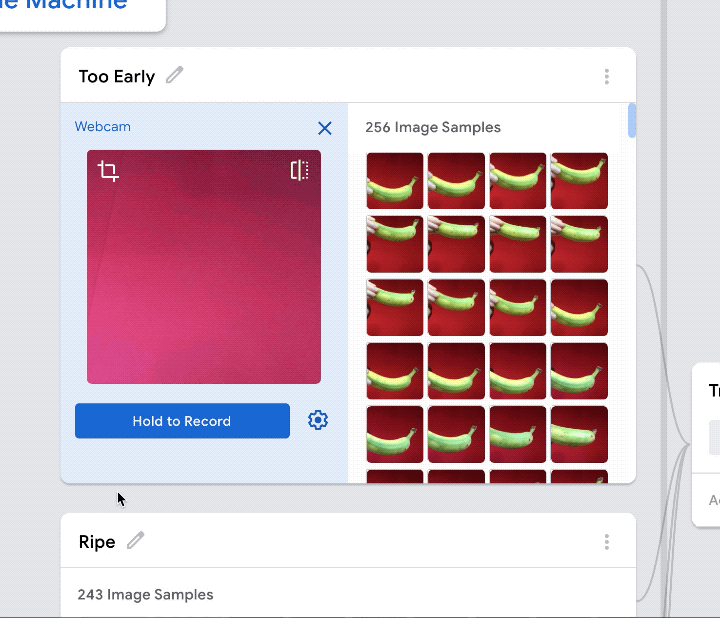
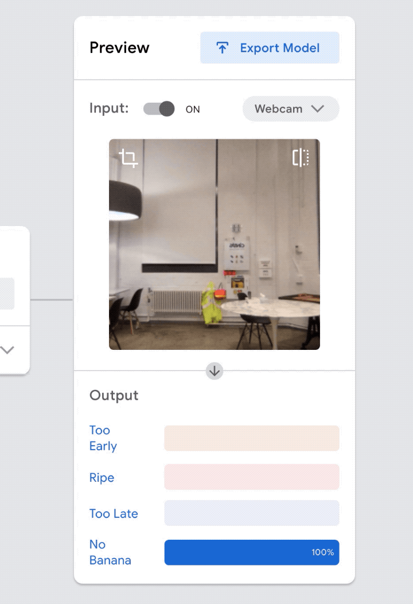

# Teachable Machine-ээр Машин Сургах Хичээл: Гадилын Болц Хэмжигч

**Сайн уу!** Энэ бол [Teachable Machine](https://teachablemachine.withgoogle.com/) хэмээх вэбд суурилсан хэрэгслийн хичээл юм. Энэ хэрэгсэл нь машин сургалтын загварыг хурдан, хялбар, хүн бүрт хүртээмжтэйгээр бүтээх боломжийг олгодог.

Энэ хичээл дээр би танд хэрхэн **гадил жимсний болцыг** зураг ашиглан илрүүлэх машин сургалтын загвар бүтээхийг үзүүлнэ. Заавал гадил жимс байх шаардлагагүй — өнгө нь өөрчлөгддөг ямар ч жимс байж болно, эсвэл гурван өөр объект ашиглаж болно — гэхдээ бидэнд гадил жимс сонирхолтой санагдсан юм.

Хэрэв гар дээр гадил байхгүй бол өөр ямар нэгэн объект ашиглаж болно. Бас заавал гар дээр ч байх албагүй, чиний ашиглах гэж буй ангилалд тохирох л бол интернэтээс дурын объектыг зургаар нь татаж авч, ангилалдаа ашиглаж болно.

[comment]: <> (Нэмээд өөр хоёр дасгал хичээл бий — нэг нь **аудио** ашиглан машин сургалтын загвар бүтээх, нөгөө нь **поз** ашиглах хичээл юм.)

Тэгэхээр эхлэхийн тулд бид Teachable Machine руу орж [зураг төсөл](https://teachablemachine.withgoogle.com/train/image) нээнэ.

### **ХЭРХЭН МАШИНИЙГ СУРГАХ ВЭ**

Машиныг сургаж эхлэхийн тулд эхлээд өөр өөр категори буюу ангиллуудыг үүсгэх хэрэгтэй. Энд хэдүүлээ дөрвөн ангилал үүсгэх гэж байна — нэг нь болж гүйцээгүй гадилуудад, нэг нь бүрэн боловсорсон гадилуудад, нөгөө нь хэт боловсорсон гадилуудад, тэгээд сүүлийнх нь гадил огт байхгүй зургуудад зориулсан ангилал.

Ангиллуудаа үүсгэсэн тул тус бүрт нь суралцах жишээ зургуудыг өгөх болно. Энэ тохиолдолд тэдгээр нь зүгээр л гадил жимсний зургууд байх юм — тэгэхээр эхлээд “Болж Гүйцээгүй” гадилын зургаас эхэлье.

Дараа нь бид мөн адил бүрэн боловсорсон гадилын зурагтай ажиллана.

Тэгээд бас нилээн удсан гадил

Эцэст нь, гадил жимс огт байхгүй зураг нэмнэ. Энэ тохиолдолд би гадилгүй гараа мөн харуулж байгаа, ингэснээр зөвхөн гадилтай ангиллуудад гар гарч байгаа гэдэг холбоосыг машин үүсгэхгүй бөгөөд боловсорсон, боловсроогүй, хэт их боловсорсон гэх мэтээр ангилахдаа заавал гар орсон зураг байх шаардлагатай гэж ойлгохоос сэргийлж байгаа юм.

Одоо бүх ангиллууд маань бэлэн болсон тул сургалтыг эхлүүлэхийн тулд “train” буюу сургалтыг эхлүүлэх товчийг дарна.

### **ОРОЛДОЖ ҮЗЭХ ЗҮЙЛС*

За, одоо энэ моделийг сургачихсан тул үүнийг хэрхэн ажиллаж байгааг туршиж үзээрэй — бас илүү сонирхолтой нь хаана ажиллахгүй байгааг олж харах боломжтой. Загварын ажиллах, ажиллахгүйн хязгаарыг олж тогтоож үзээрэй — машин сургалтанд хязгаар бий!

Компьютерт бол зургууд нь зүгээр л тоо, пикселүүдийн хээ маягаар харагддагийг санаарай.

Тиймээс бид үнэндээ түүнд гадил гэж юу болохыг заагаагүй... Харин бид үүнийг арын дэвсгэр дээрх шар хэлбэрийг боловсорсон гадил гэж нэрлэхийг зааж өгсөн. Компьютерийн хувьд энэ нь яг үнэндээ зүгээр л пиксел болон пиксел хоорондын ялгаа юм.

Үүнээс үүдэлтэйгээр модел нь олон зүйл дээр андуурах, алдаа гаргах боломжтой байдаг. Тэгэх хэдэн жишээг нь авч үзье.

### **ХОЁР БАНАНА**

Жишээлбэл, та хоёр гадилыг зэрэг барьж үзүүлбэл модел бүрэн ойлгож чадахгүй. Сургалтын явцад загвар өмнө нь ийм төрлийн жишээ үзээгүй тул төөрөлдөж магадгүй.

### **ӨӨР ӨНГИЙН ДЭВСГЭР БОЛОН ГЭРЭЛТҮҮЛЭГ*

Эсвэл гадилуудаа өөр өнгийн хананы өмнө, өөр дэвсгэр дээр туршиж үзэж болно. Ийм нөхцөлд модел маань хэвийн ажиллаж байна уу?

Энэ шинэ дэвсгэр дээр зарим ангиллууд бага зэрэг төөрөлдөж магадгүй…

…тиймээс шинэ дэвсгэр дээр авсан зурагнуудыг ангилал болгонд нэмэлт жишээ, сургах материал болгож оруулна.

Загвараа илүү найдвартай болгохын тулд гадилуудаа өөр орчинд байхад нь зургийг нь аваад нэмэлтээр сургалтандаа оруулж өгч болно, ингэснээр модел маань өөр өөр дэвсгэр дээр ажиллах чадвартай болно. Би эдгээр дэвсгэр дээрх гадил жимсний нэмэлт жишээ зургуудыг нэмж оруулсан тул одоо гадилыг илүү сайн таних чадвартай болсон:

Моделоо улам сайжруулахын тулд интернэтээс татсан гадилын зурагнуудыг оруулж болно.

### **МОДЕЛИЙГ ХУУРАХ ГЭЖ ОРОЛД**

Гадил жимсний оронд утсан дээрээ байгаа гадилын зураг бариад үз! Эсвэл гараараа зурсан гадилыг бариад үз! Эсвэл гадил шиг харагдах тоглоом ашиглаад үз! Загвар өөр өөр гадил шиг зүйлсүүдийг хэрхэн таньж байгааг харж, яаж төөрөлдүүлэхгүй байхаар сургаж болохыг бодоод, туршаад үзээрэй.

### **ЭНҮҮГЭЭР ЮУ ХИЙЖ БОЛОХ ВЭ?**

Та модел оо экспортлоод, хүсвэл ашиглан сайт эсгүй бол аппликейшн бүтээж болно. 

Жишээлбэл, энэ моделийг экспортлоод гадилын болцыг тодорхойлдог [вебсайт](https://tm-image-demo.glitch.me/) Glitch платформ дээр хийсэн. Та туршиж үзэж болно, гэхдээ таны үр дүн харилцан адилгүй байж магад.

Өөр хэн нэгэн Teachable Machine-ийн зураг ашигладаг загвараар [удирддаг тоглоом](https://teachable-arcade.glitch.me/) хийсэн.

### **ОДОО ЯАХ ВЭ?**

Хэрвээ та өөрийн гэсэн модел сургаж үзэхийг хүсвэл [Teachable Machine](https://teachablemachine.withgoogle.com/) сайт-аар яг одоо эхэлж болно. Зөвхөн зураг ялгах модел биш, бас дуу авиа ялгах, аль тийшээ толгойгоо хазайлгаж байгааг ялгах модел сургаж болно.